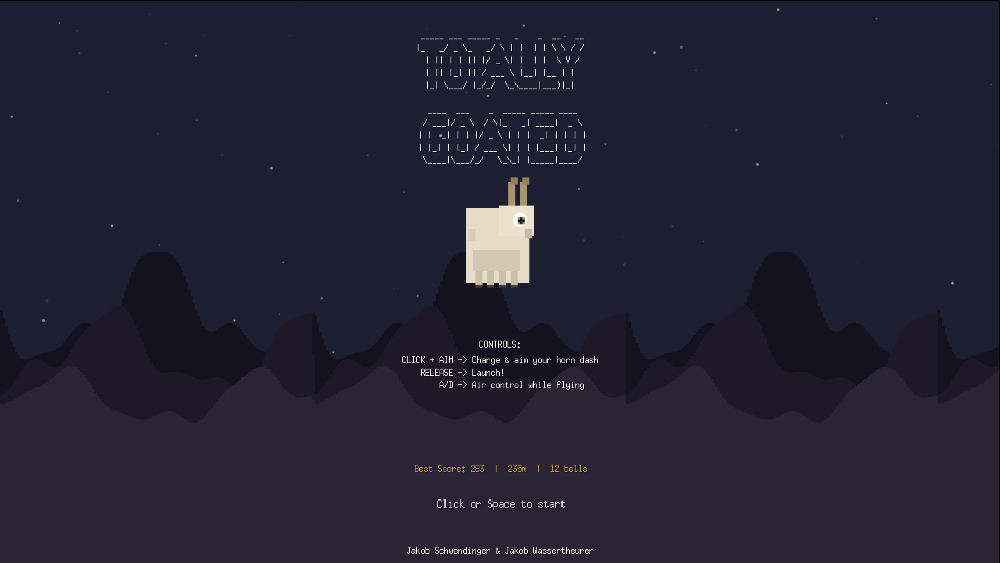

# Totally Goated 🐐

A vertical climbing platformer built with [Go](https://go.dev/) and [Ebitengine](https://ebitengine.org/). Dash upward as a goat, bounce off platforms, collect bells, grab power-ups, and climb as high as you can.

<p align="center">
  
</p>

## Gameplay

You control a goat that wall-clings to procedurally generated platforms. **Click and aim** to charge a horn dash, then **release** to launch. Use **A/D** for mid-air control. Chain bell pickups for combo multipliers and chase your high score.

### Game States

| State | Description |
|-------|-------------|
| **Menu** | Title screen with ASCII art, controls overview, and best scores |
| **Playing** | Core gameplay — climb, dash, collect |
| **Game Over** | Score summary with height, bells, total score, and personal bests |

### Platform Types

| Type | Effect |
|------|--------|
| **Normal (Rock)** | Standard wall-cling surface |
| **Bouncy** | Reflects the goat with boosted speed (min bounce speed: 8.0) |
| **Ice** | Slides the goat along the surface (slide speed: 1.8) |
| **Crumbly** | Crumbles and is destroyed after 1.0s of contact |
| **Sticky** | Reduces dash power (50% dash multiplier) |

Special platform types appear after platform index 10, with increasing probability as difficulty rises.

### Power-Ups

| Power-Up | Effect |
|----------|--------|
| **Shield** | Saves you from one death (respawns at camera top) |
| **Super Dash** | 1.5× dash speed multiplier |
| **Slow Fall** | Reduces gravity to 45% for 5.0 seconds |
| **Double Jump** | Grants an extra jump at 12.0 speed while airborne |

Power-ups spawn with a 10% chance (minimum 3 platforms apart) and bob in place with a colored glow.

### Bells & Scoring

- **Bells** spawn with a 35% chance and award **5 base points** each
- Collecting bells within a **1.5s combo window** chains a multiplier (up to ×5)
- **Total score** = height in meters + bell score
- Height milestones every 100m trigger a milestone sound
- Best scores, height, and bell counts are persisted to `save.json`

### Goat Mechanics

| Mechanic | Details |
|----------|---------|
| **Wall Cling** | Attach to platform sides; wall-slide speed: 0.55 |
| **Charge Dash** | Hold click to charge (up to 1.0s), aim with cursor. Speed range: 8.0–20.0 |
| **Dash Cooldown** | 0.25s between dashes |
| **Air Control** | Subtle horizontal acceleration (0.15) while airborne |
| **Gravity** | 0.35 per tick, max fall speed 9.5 |
| **Squash & Stretch** | Visual deformation on impacts, lerps back smoothly |
| **Screen Shake** | Impacts trigger camera shake that decays at 0.88× per frame |

### Difficulty Scaling

The procedural level generator increases difficulty based on climb height:
- Platforms get **narrower** (90→55 max width, 50→30 min width) and **shorter** (160→50 max height)
- **Gaps** between platforms increase
- **Special platform** probability rises
- Horizontal **spread** grows, making jumps more demanding

## Controls

| Input | Action |
|-------|--------|
| **Click + Aim** | Charge and aim your horn dash |
| **Release** | Launch |
| **A / D** | Air control while flying |
| **Space** | Start game / Continue after game over / Doublejump | 

## Tech Stack

- **Language:** Go 1.25
- **Engine:** [Ebitengine v2.9.9](https://ebitengine.org/)
- **Audio:** WAV playback via `ebiten/v2/audio` (44100 Hz sample rate)
- **Assets:** Embedded at compile time via `embed.FS`
- **Resolution:** 1280×720 (fullscreen on desktop, windowed on WASM)
- **Save System:** JSON file (`save.json`) for persistent high scores

## Project Structure

```
├── main.go              # Entry point — window setup, asset init, game loop
├── go.mod               # Module: totally-goated
├── build-wasm.sh        # WASM build script
├── save.json            # Persistent high scores
├── assets/
│   ├── textures/        # PNG sprites
│   └── sound/           # WAV sound effects
├── game/
│   ├── assets.go        # Embedded FS loader, asset initialization
│   ├── audio.go         # WAV decoding and SoundPlayer system
│   ├── bell.go          # Bell collectible (spawn, bob, draw)
│   ├── constants.go     # Physics, timing, and gameplay constants
│   ├── floatingtext.go  # Floating score text popups
│   ├── game.go          # Game struct, state machine, Update/Draw/Layout
│   ├── goat.go          # Goat struct, states (Air/Wall/Charging), movement
│   ├── hud.go           # HUD rendering (meters, bells, combos, power-up badges)
│   ├── level.go         # Procedural level generation, platform types, difficulty
│   ├── particle.go      # Particle system for dust effects
│   ├── powerup.go       # power-up types with glow rendering
│   ├── save.go          # JSON save/load for best scores
│   ├── speedlines.go    # Speed line visual effect
│   ├── star.go          # Starfield background
│   └── vec2.go          # 2D vector math utilities
└── wasm/
    ├── index.html       # Web host page
    ├── wasm_exec.js     # Go WASM runtime support
    └── game.wasm        # Compiled WASM binary (build output)
```

## Building & Running

### Prerequisites

- [Go 1.25+](https://go.dev/dl/)
- For cross-compilation: platform-specific C compiler (CGO) or use `CGO_ENABLED=0` where possible

---

### Desktop (run directly)

```bash
go run .
```

---

### Windows (.exe)

```bash
# Native build (on Windows):
go build -o totally-goated.exe .

# Cross-compile from macOS/Linux:
GOOS=windows GOARCH=amd64 CGO_ENABLED=0 go build -o totally-goated.exe .
```

---

### macOS

```bash
# Native build:
go build -o totally-goated .

# Cross-compile for Apple Silicon:
GOOS=darwin GOARCH=arm64 go build -o totally-goated-arm64 .

# Cross-compile for Intel Mac:
GOOS=darwin GOARCH=amd64 go build -o totally-goated-amd64 .
```

---

### Linux

```bash
# Native build:
go build -o totally-goated .

# Cross-compile from macOS/Windows:
GOOS=linux GOARCH=amd64 CGO_ENABLED=0 go build -o totally-goated-linux .
```

---

### WebAssembly (Browser)

```bash
# 1. Build the WASM binary
GOOS=js GOARCH=wasm go build -o wasm/game.wasm .

# 2. Ensure wasm_exec.js matches your Go version
cp "$(go env GOROOT)/misc/wasm/wasm_exec.js" wasm/

# 3. Serve the wasm/ directory
cd wasm && python3 -m http.server 8080
```

Then open `http://localhost:8080` in a browser.


## Authors

**Jakob Schwendinger** & **Jakob Wassertheurer**
